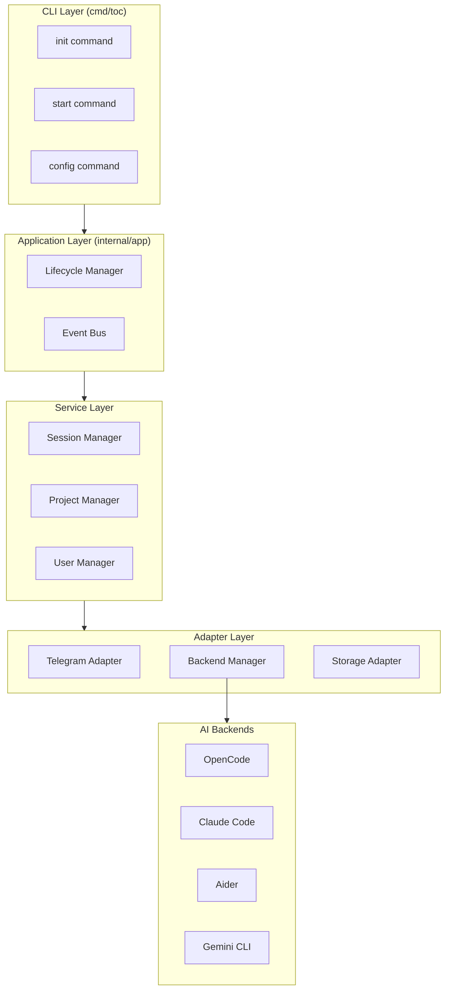
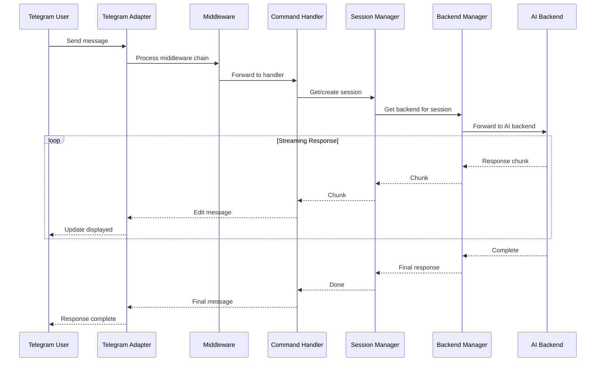
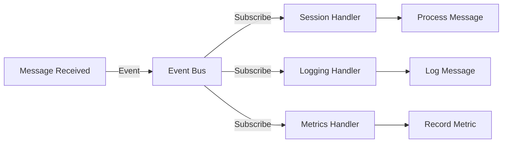

# Architecture

## Overview

TOC follows a layered architecture with clear separation of concerns. The design prioritizes:

1. **Abstraction** - No hard dependency on any specific AI backend
2. **Extensibility** - Easy to add new backends, features, and plugins
3. **Testability** - All components can be tested independently
4. **Simplicity** - Minimal boilerplate, clear data flow

## High-Level Architecture

```
┌─────────────────────────────────────────────────────────────────┐
│                        CLI Layer (Cobra)                        │
│  ┌──────────┐  ┌──────────┐  ┌──────────┐  ┌──────────┐       │
│  │   init   │  │  start   │  │  config  │  │  status  │       │
│  └──────────┘  └──────────┘  └──────────┘  └──────────┘       │
└─────────────────────────────────────────────────────────────────┘
                              │
                              ▼
┌─────────────────────────────────────────────────────────────────┐
│                    Application Layer                            │
│  ┌─────────────────┐  ┌─────────────────┐  ┌─────────────────┐  │
│  │    Lifecycle     │  │     EventBus    │  │    Registry     │  │
│  │  (Start/Stop)    │  │ (Pub/Sub)       │  │ (DI Container)  │  │
│  └─────────────────┘  └─────────────────┘  └─────────────────┘  │
└─────────────────────────────────────────────────────────────────┘
                              │
                              ▼
┌─────────────────────────────────────────────────────────────────┐
│                      Service Layer                              │
│  ┌─────────────┐  ┌─────────────┐  ┌─────────────┐            │
│  │   Session   │  │   Project   │  │    User     │            │
│  │   Manager   │  │   Manager   │  │   Manager   │            │
│  └─────────────┘  └─────────────┘  └─────────────┘            │
└─────────────────────────────────────────────────────────────────┘
                              │
        ┌─────────────────────┼─────────────────────┐
        ▼                     ▼                     ▼
┌───────────────┐   ┌───────────────┐   ┌───────────────┐
│   Telegram    │   │   AI Backend  │   │   Storage     │
│   Adapter     │   │   Adapter     │   │   Adapter     │
│               │   │               │   │               │
│  go-telegram/ │   │ ┌───────────┐ │   │  gorm.io/     │
│  bot          │   │ │ OpenCode  │ │   │  gorm +       │
│               │   │ ├───────────┤ │   │  SQLite       │
│               │   │ │ Claude    │ │   │               │
│               │   │ ├───────────┤ │   │               │
│               │   │ │ Aider     │ │   │               │
│               │   │ ├───────────┤ │   │               │
│               │   │ │ Gemini    │ │   │               │
│               │   │ └───────────┘ │   │               │
└───────────────┘   └───────────────┘   └───────────────┘
```

## Layer Responsibilities

### 1. CLI Layer

**Purpose:** Parse user commands and flags, initialize the application.

**Responsibilities:**
- Command parsing (Cobra)
- Flag validation
- Help text generation
- Shell completion
- Signal handling (SIGINT, SIGTERM)

**Does NOT contain:**
- Business logic
- Direct database access
- External API calls

### 2. Application Layer

**Purpose:** Orchestrate component lifecycle and cross-cutting concerns.

**Components:**

- **Lifecycle:** Manages startup/shutdown order of all components
- **EventBus:** Decoupled communication between components
- **Registry:** Dependency injection container (optional, can use simple construction)

```go
// Lifecycle ensures components start and stop in correct order
type Lifecycle struct {
    components []Component
    started    []Component
}

type Component interface {
    Start(ctx context.Context) error
    Stop(ctx context.Context) error
}
```

### 3. Service Layer

**Purpose:** Business logic for core domain objects.

**Services:**

- **SessionManager:** Create, list, switch, delete coding sessions
- **ProjectManager:** Manage projects and workspaces
- **UserManager:** User CRUD and permission checks

**Rules:**
- Services depend on interfaces (Storage, Backend)
- Services do NOT depend on Telegram or CLI directly
- Services are pure business logic

### 4. Adapter Layer

**Purpose:** Isolate external dependencies behind interfaces.

**Adapters:**

- **TelegramAdapter:** Wraps `go-telegram/bot` library
- **BackendAdapter:** Wraps AI coding agents (OpenCode, Claude, etc.)
- **StorageAdapter:** Wraps GORM/SQLite

**Key Pattern:** Each adapter implements an interface defined in the service layer.

## Component Diagram



## Data Flow

### Message Flow (User → AI → User)



### Event Flow



## Key Interfaces

### Backend Interface

```go
type Backend interface {
    Name() string
    Initialize(ctx context.Context, config BackendConfig) error
    CreateSession(ctx context.Context, opts SessionOpts) (*Session, error)
    SendMessage(ctx context.Context, req *SendMessageRequest) (*SendMessageResponse, error)
    StreamMessage(ctx context.Context, req *SendMessageRequest) (<-chan StreamChunk, error)
    Capabilities() *Capabilities
    Health(ctx context.Context) error
}
```

### Storage Interface

```go
type Storage interface {
    Migrate(ctx context.Context) error
    Close() error
    SaveSession(ctx context.Context, session *Session) error
    GetSession(ctx context.Context, id string) (*Session, error)
    ListSessions(ctx context.Context, filter SessionFilter) ([]*Session, error)
    DeleteSession(ctx context.Context, id string) error
    SaveMessage(ctx context.Context, msg *Message) error
    GetMessages(ctx context.Context, sessionID string, limit, offset int) ([]*Message, error)
    SaveUser(ctx context.Context, user *User) error
    GetUser(ctx context.Context, id int64) (*User, error)
}
```

## Concurrency Model

```
┌─────────────────────────────────────────────────────────────┐
│                    Goroutine Model                          │
├─────────────────────────────────────────────────────────────┤
│                                                             │
│  Main Goroutine                                             │
│      │                                                      │
│      ├── Telegram Update Loop (1 goroutine)                 │
│      │       │                                              │
│      │       ├── Handler Goroutine (1 per update)           │
│      │       │       │                                      │
│      │       │       └── Backend Call (with context)        │
│      │       │                                              │
│      │       └── Response Stream (channel)                  │
│      │                                                      │
│      ├── Event Bus Workers (N goroutines)                   │
│      │                                                      │
│      └── Storage Connection Pool (managed by GORM)          │
│                                                             │
└─────────────────────────────────────────────────────────────┘
```

**Rules:**
- Each Telegram update processed in its own goroutine
- Backend calls use `context.Context` for cancellation
- Streaming responses use buffered channels
- Storage operations are serialized per session

## Error Handling Strategy

```
┌─────────────────────────────────────────────────────────────┐
│                    Error Categories                          │
├─────────────────────────────────────────────────────────────┤
│                                                             │
│  User Errors (safe to show)                                 │
│      ├── "Session not found"                                │
│      ├── "Unauthorized"                                     │
│      └── "Invalid command"                                  │
│                                                             │
│  Transient Errors (retry with backoff)                      │
│      ├── Network timeout                                    │
│      ├── Rate limit                                         │
│      └── Backend temporarily unavailable                    │
│                                                             │
│  Fatal Errors (log + graceful shutdown)                     │
│      ├── Database corruption                                │
│      ├── Invalid configuration                              │
│      └── System resource exhaustion                         │
│                                                             │
└─────────────────────────────────────────────────────────────┘
```

**Pattern:**
```go
// Always wrap errors with context
if err := storage.SaveSession(ctx, session); err != nil {
    return fmt.Errorf("save session %s: %w", session.ID, err)
}
```

## Configuration Hierarchy

```
Priority (highest to lowest):
1. Command-line flags
2. Environment variables (TOC_ prefix)
3. Config file (~/.toc/config.toml)
4. Default values
```

## Security Model

```
┌─────────────────────────────────────────────────────────────┐
│                    Security Layers                          │
├─────────────────────────────────────────────────────────────┤
│                                                             │
│  Telegram Layer                                             │
│      ├── User ID validation                                 │
│      ├── Chat ID validation (groups)                        │
│      └── Rate limiting                                      │
│                                                             │
│  Application Layer                                          │
│      ├── User authentication                                │
│      ├── Role-based access (admin/user/viewer)              │
│      └── Session ownership validation                       │
│                                                             │
│  Backend Layer                                              │
│      ├── API key storage (OS keyring)                       │
│      ├── Command execution sandboxing                       │
│      └── Output sanitization                                │
│                                                             │
│  Storage Layer                                              │
│      ├── File permissions                                   │
│      └── Data encryption (future)                           │
│                                                             │
└─────────────────────────────────────────────────────────────┘
```

## Design Patterns Used

| Pattern | Where | Purpose |
|---------|-------|---------|
| **Strategy** | Backend selection | Choose backend based on config/session |
| **Factory** | Backend creation | Create backend instances from config |
| **Adapter** | All adapters | Wrap external libraries behind interfaces |
| **Middleware** | Telegram handlers | Cross-cutting concerns (auth, logging) |
| **Observer** | EventBus | Decoupled component communication |
| **Repository** | Storage | Abstract database operations |
| **Options** | Config structs | Functional options pattern |

## Future Extensibility

The architecture supports adding:

1. **New Backends** - Implement `Backend` interface, register in manager
2. **New Commands** - Add to `cmd/toc` package
3. **New Middleware** - Add to middleware chain
4. **Plugins** - Implement `Plugin` interface
5. **New Storage Backends** - Implement `Storage` interface
6. **Web UI** - Add new adapter layer
7. **Metrics** - Subscribe to events, export to Prometheus
8. **Webhooks** - New Telegram transport mode
